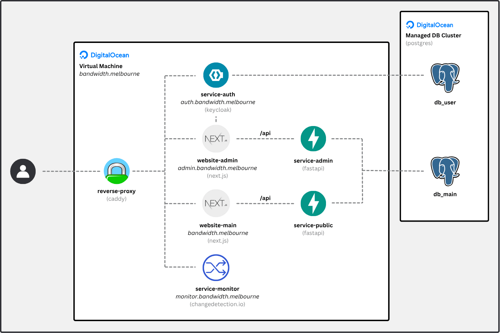

# Deployment

This repository contains resources and scripts for deploying Bandwidth services and infrastructure under the domain `melbourne.bandwidth`.

## System Architecture

Basic microservices architecture using Dockerized containers within a VM.



### Containers

The deployment uses the following containers.

| Container      | Port(s)       | Domain / Path                | Tech              | Purpose                                  |
|----------------|---------------|------------------------------|-------------------|-----------------------------------------|
| reverse-proxy  | :80 / :443    | -                            | Caddy             | Routes traffic to internal services     |
| website-admin  | :3000         | admin.bandwidth.melbourne    | Next.js           | Admin dashboard for managing content    |
| service-admin  | :80           | /api (admin)                 | FastApi / Uvicorn | Backend API for admin site              |
| website-main   | :3000         | bandwidth.melbourne          | Next.js           | Public-facing website                   |
| service-public | :80           | /api (public)                | FastApi / Uvicorn | Backend API for public site             |
| service-auth   | :8080         | auth.bandwidth.melbourne     | Keycloak          | SSO, Authentication and user management |
| service-monitor| :5000         | monitor.bandwidth.melbourne  | Changedetection   | Monitors changes on venue websites      |

### Databases

The deployment relies upon a managed postgres database cluster with the following databases.

| Database       | Used By                       | Purpose                                     |
|----------------|-------------------------------|---------------------------------------------|
| db_main        | service-public, service-admin | Stores gig guide content                    |
| db_user        | service-auth                  | Stores user identities, roles, and sessions |

## Deployment Steps

Populate the `template.env` file with appropriate values, then rename it `.env`.

Run the following command.

```sh
docker compose up -d --build
```


